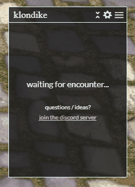
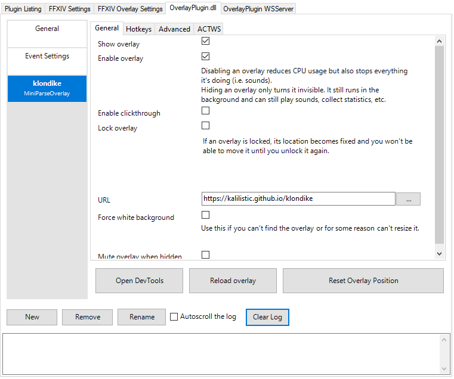

<h1 align="center">
   
   klondike 
</h1>
<h4 align="center">FFXIV ACT Combat Overlay</h4>

  
  
  

## Background

klondike is a combat overlay for use with ACT for FFXIV. You can view your dps and other combat stats with a customizable and modern layout.

## Demo

## Key Features

* Track your DPS and other key combat stats.
* Easily see your contribution with the damage% bar.
* View additional stats by clicking on a party member.
* Make the overlay your own with many customization settings.
* Collapse the overlay to save screen real estate when not in combat.
* Support for English, French, German, Japanese, Chinese, and Korean.

## Prerequisites

* <a href="https://github.com/EQAditu/AdvancedCombatTracker">Advanced Combat Tracker</a>
* <a href="https://github.com/ravahn/FFXIV_ACT_Plugin">FFXIV_ACT_Plugin</a>
* <a href="https://github.com/EQAditu/AdvancedCombatTracker">Advanced Combat Tracker</a>
* <a href="https://github.com/ngld/OverlayPlugin">ngld's OverlayPlugin</a>

**Notes**
* You can find the setup guide <a href="https://github.com/FFXIV-ACT/setup-guide#readme">here</a>.
* klondike is **not compatible** with the deprecated hibiyasleep nor RainbowMage Overlay Plugins. See an explanation 
  <a href="https://gist.github.com/ngld/e2217563bbbe1750c0917217f136687d#what-is-the-difference-between-the-ngld-overlayplugin-and-hibiyasleep-overlayplugin">here</a> on the differences and why to upgrade.

## How To Install

1. Ensure your ACT, FFXIV ACT Plugin, and Overlay Plugin are up-to-date.
2. Add a custom overlay as described <a href="https://github.com/FFXIV-ACT/setup-guide#custom-overlays">here</a> and use https://kalilistic.github.io/klondike as the URL.

</a>

## Troubleshooting
* **The overlay won't open.** 
  Make sure you are using ngld's overlay and have everything setup as described <a href="https://github.com/FFXIV-ACT/setup-guide#readme">here</a>.

* **The overlay is too small / big.** 
  In your overlay plugin tab, select klondike, and then Advanced. You'll find a "Zoom" slider you can adjust to fit your preference.
  
* **My problem isn't listed here.**
  You can find the ACT FAQ <a href="https://gist.github.com/ngld/e2217563bbbe1750c0917217f136687d">here</a>. If you still have a problem, raise an issue or reach out on discord.
